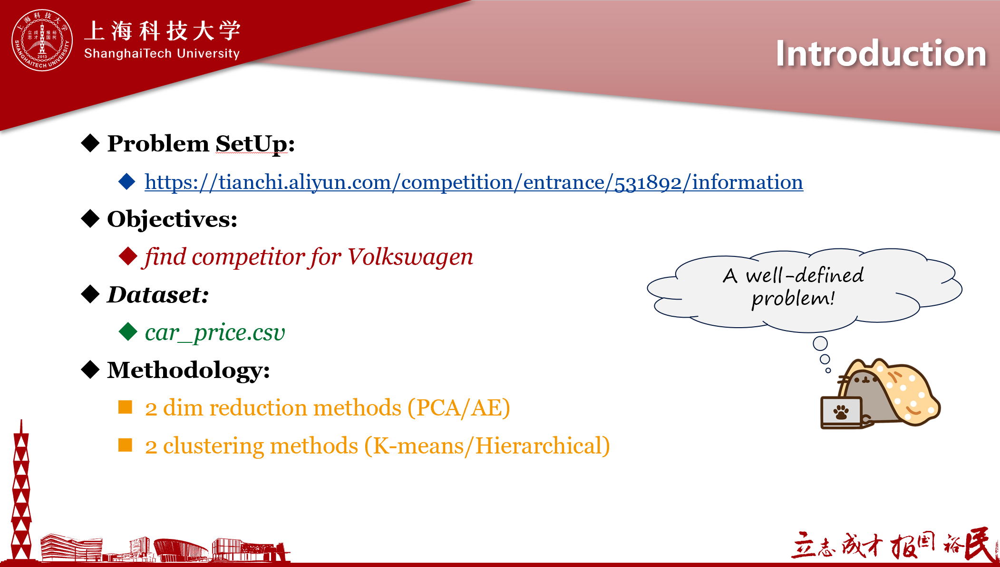
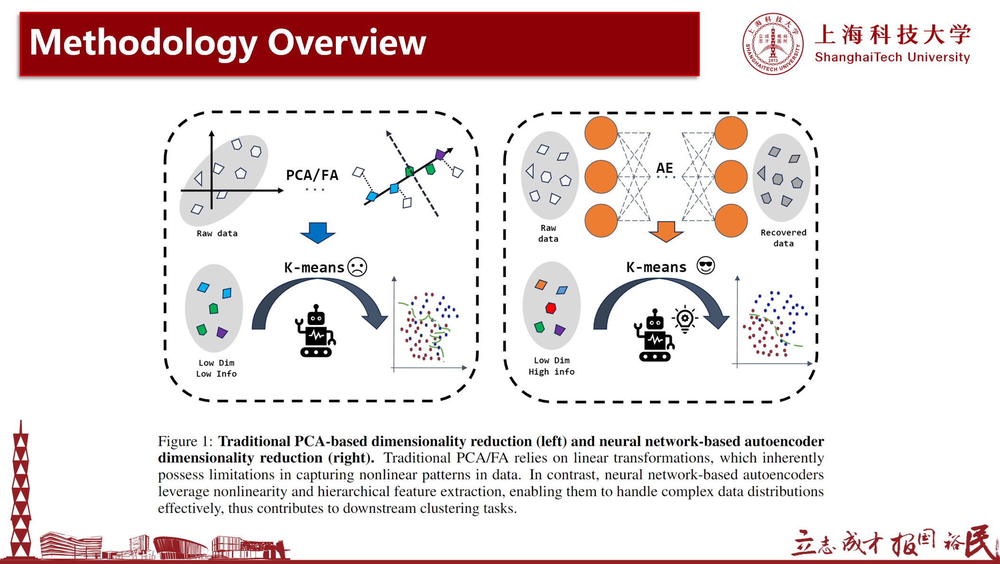
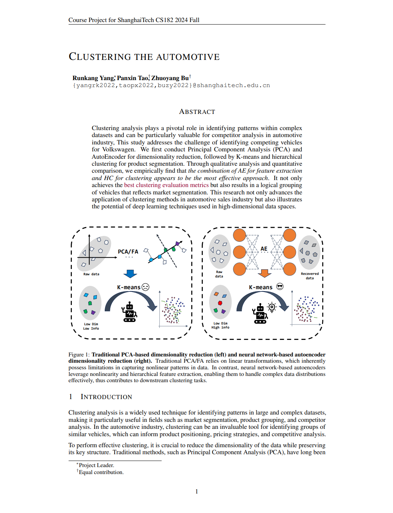

# ShanghaiTech-CS182-Project

2024 Fall ShanghaiTech CS182

上海科技大学《机器学习引论》课程项目

***Introduction to Machine Learning - Course Project***

*Final Grade : **A***

---

## Introduction & Problem SetUp
https://tianchi.aliyun.com/competition/entrance/531892/information

## Methodology
*(For more details, see ./presentation/final_presentation.pptx)*

## Paper Writing
**Required Structure of The Report**
+ **Abstract: 10% grade**
+ **Introduction of the problem: 10% of grade**  
+ **Models applied: 35% of grade**  
   a) If your project involves comparing existing methods, select at least 3 methods and provide a detailed overview of each.  
   b) If your project aims to improve existing methods or propose novel methods, provide a critical overview of existing work before introducing your new methods.  
+ **Numerical results: 30% of grade**  
+ **Conclusions: 10% of grade**
+ **References: 5% of grade**

*(See more details at ./docs/iclr2025_conference.pdf)*